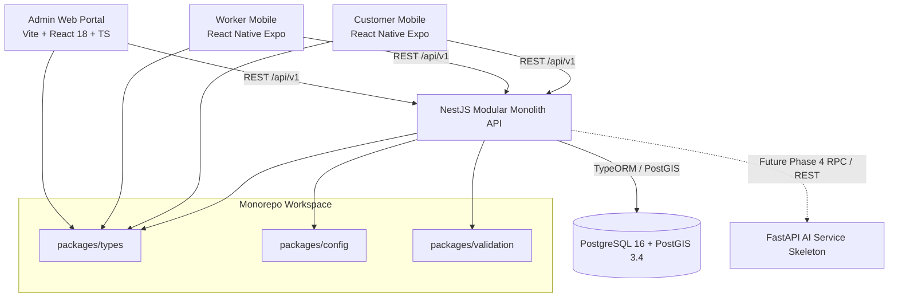

# CSHRK System Architecture Overview

## 1. Architectural Style: Modular Monolith
CSHRK adopts a **Modular Monolith** pattern for the backend service (`services/api`). This avoids premature distributed microservices complexity while maintaining clean separation of concerns through NestJS domain modules.

## 2. Spatial Engine: PostgreSQL + PostGIS (SRID 4326)
- PostGIS enables native geographic queries:
  - Measuring exact geodesic distance between customer demand and available workers (`ST_DistanceSphere`).
  - Checking whether a job location falls within a Cooperative's registered district boundary (`ST_Contains`).
  - Spatial indexing using GiST indexes for millisecond query performance.

## 3. AI Service Boundary
- The AI service is decoupled into `services/ai` (Python FastAPI) to allow high-performance numerical computing (NumPy, Scikit-learn, PyTorch) in future Phase 4 without polluting the Node.js API runtime.
