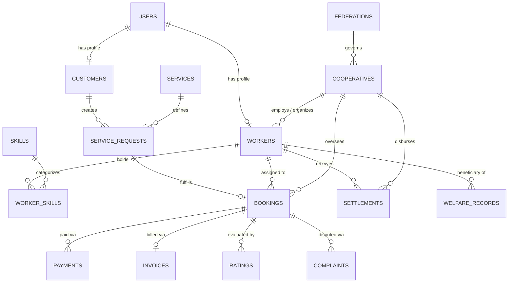

# CSHRK Entity Relationship Diagram (ERD)

```mermaid
erDiagram
    USERS ||--o| CUSTOMERS : "has profile"
    USERS ||--o| WORKERS : "has profile"
    FEDERATIONS ||--o{ COOPERATIVES : "governs"
    COOPERATIVES ||--o{ WORKERS : "employs / organizes"
    WORKERS ||--o{ WORKER_SKILLS : "holds"
    SKILLS ||--o{ WORKER_SKILLS : "categorizes"
    CUSTOMERS ||--o{ SERVICE_REQUESTS : "creates"
    SERVICES ||--o{ SERVICE_REQUESTS : "defines"
    SERVICE_REQUESTS ||--o| BOOKINGS : "fulfills"
    WORKERS ||--o{ BOOKINGS : "assigned to"
    COOPERATIVES ||--o{ BOOKINGS : "oversees"
    BOOKINGS ||--o{ PAYMENTS : "paid via"
    BOOKINGS ||--o| INVOICES : "billed via"
    BOOKINGS ||--o{ RATINGS : "evaluated by"
    BOOKINGS ||--o{ COMPLAINTS : "disputed via"
    WORKERS ||--o{ SETTLEMENTS : "receives"
    COOPERATIVES ||--o{ SETTLEMENTS : "disburses"
    WORKERS ||--o{ WELFARE_RECORDS : "beneficiary of"
```
