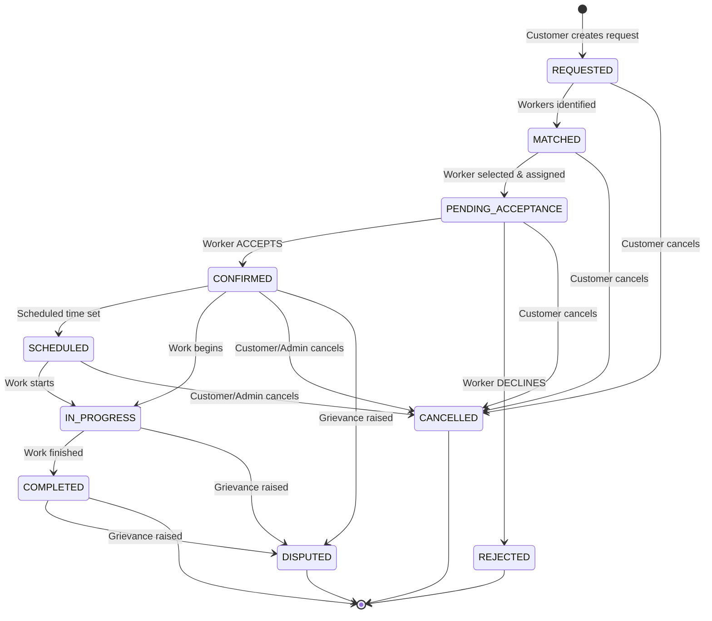

# CSHRK Phase 2 — Customer & Marketplace Handover Document

```text
================================================================================
  PROJECT:                 CSHRK (Cooperative Labour & Service Marketplace)
  CURRENT PHASE:           PHASE 2 COMPLETED & VERIFIED
  PREVIOUS PHASES:         PHASE 0 (Foundation) & PHASE 1 (Worker & Workforce)
  NEXT PHASE:              PHASE 3 — COOPERATIVE & FEDERATION GOVERNANCE
  STATUS:                  FULL CUSTOMER MARKETPLACE & DISPATCH VERIFIED
================================================================================
```

---

## 1. Phase 2 Executive Summary & Objectives

**Phase 2 — Customer & Marketplace Discovery** delivers the complete customer-facing service marketplace for CSHRK, establishing a verified, cooperative-governed trade dispatch lifecycle connecting consumers and institutional clients with primary cooperative member workers.

### Core Objectives Achieved:
1. **Customer Profile & Location Management**: Customer account onboarding, profile management, saved address, and PostGIS Point (SRID 4326) coordinates.
2. **Database-Backed Service Catalog**: Real database-driven service catalog with trade categorization, search, pricing models, and direct linkage to standardized trade skills (`SkillEntity`).
3. **Deterministic Geospatial Worker Discovery**: Real-time worker discovery using PostGIS `ST_DistanceSphere` calculating geodesic distance against available certified workers holding required trade credentials within configurable radii.
4. **Transaction-Safe Booking & State Machine**: Canonical `BookingStatus` lifecycle enforced across all workspaces, with transactional concurrency protection against double bookings and schedule overlaps.
5. **Phase 1 Worker System Integration**: Full bidirectional dispatch flow where bookings dispatch to worker queues (`GET /workers/me/jobs`) and workers accept (`CONFIRMED`) or decline (`REJECTED`) without breaking existing Phase 1 endpoints.
6. **Customer Rating & Review Foundation**: Customer-to-Worker rating (1–5 stars + written feedback) upon `COMPLETED` bookings, updating worker's aggregate score and total completed jobs.
7. **Administrative Marketplace Monitoring**: Web admin dashboard view for tracking active demands, booking lifecycle states, and worker assignments.

---

## 2. Canonical Booking State Machine



### State Transition Validation Matrix
| Current Status | Permitted Next Statuses | Actor / Mechanism |
| :--- | :--- | :--- |
| `REQUESTED` | `MATCHED`, `PENDING_ACCEPTANCE`, `CANCELLED` | System / Customer |
| `MATCHED` | `PENDING_ACCEPTANCE`, `CANCELLED` | Customer |
| `PENDING_ACCEPTANCE` | `CONFIRMED`, `REJECTED`, `CANCELLED` | Worker (Accept/Decline) / Customer (Cancel) |
| `CONFIRMED` | `SCHEDULED`, `IN_PROGRESS`, `CANCELLED`, `DISPUTED` | Worker / System / Customer |
| `SCHEDULED` | `IN_PROGRESS`, `CANCELLED`, `DISPUTED` | Worker / Customer |
| `IN_PROGRESS` | `COMPLETED`, `DISPUTED` | Worker / Customer |
| `COMPLETED` | `DISPUTED` | Customer (Rate / Dispute) |
| `REJECTED` | *(Terminal for this booking; request re-enters queue)* | Worker Decline |
| `CANCELLED` | *(Terminal)* | Customer / Admin |
| `DISPUTED` | *(Terminal in Phase 2; Phase 5 handles arbitration)* | Customer / Worker |

---

## 3. PostGIS Geodesic Matching Specification

Endpoint: `GET /api/v1/service-requests/:id/candidates`

```sql
SELECT 
  worker.id AS "workerId",
  worker.user_id AS "userId",
  worker.full_name AS "fullName",
  worker.rating_avg AS "ratingAvg",
  worker.total_jobs AS "totalJobs",
  ROUND((ST_DistanceSphere(worker."currentLocation", ST_SetSRID(ST_MakePoint(:lng, :lat), 4326)) / 1000.0)::numeric, 2) AS "distanceKm",
  skill.name AS "verifiedSkillName"
FROM workers worker
INNER JOIN worker_skills ws ON ws.worker_id = worker.id AND ws.is_verified = true AND ws.skill_id = :serviceSkillId
INNER JOIN skills skill ON skill.id = ws.skill_id
WHERE worker.status = 'ACTIVE'
  AND worker.availability_status = 'AVAILABLE'
  AND worker."currentLocation" IS NOT NULL
  AND ST_DistanceSphere(worker."currentLocation", ST_SetSRID(ST_MakePoint(:lng, :lat), 4326)) <= :radiusMeters
ORDER BY ST_DistanceSphere(worker."currentLocation", ST_SetSRID(ST_MakePoint(:lng, :lat), 4326)) ASC
LIMIT :limit;
```

---

## 4. API Endpoints Reference

### 4.1 Customer Module (`/api/v1/customers`)
| Method | Path | Roles | Description |
| :--- | :--- | :--- | :--- |
| `GET` | `/customers/me` | `CUSTOMER` | Retrieve authenticated customer profile with user details |
| `PATCH` | `/customers/me` | `CUSTOMER` | Update customer name, phone, address, and default GPS coordinates |

### 4.2 Service Catalog Module (`/api/v1/services`)
| Method | Path | Roles | Description |
| :--- | :--- | :--- | :--- |
| `GET` | `/services/categories` | Any Auth | List all distinct categories with active service counts |
| `GET` | `/services` | Any Auth | Query services with search and category filtering |
| `GET` | `/services/:id` | Any Auth | Get service details including required skill linkage |

### 4.3 Service Request Module (`/api/v1/service-requests`)
| Method | Path | Roles | Description |
| :--- | :--- | :--- | :--- |
| `POST` | `/service-requests` | `CUSTOMER` | Create demand request with coordinates and urgency |
| `GET` | `/service-requests/me` | `CUSTOMER` | List customer's created service requests |
| `GET` | `/service-requests/:id` | `CUSTOMER`, `ADMIN` | Get request details (enforces customer ownership) |
| `GET` | `/service-requests/:id/candidates` | `CUSTOMER` | Discover nearby eligible workers using PostGIS `ST_DistanceSphere` |
| `PATCH` | `/service-requests/:id/cancel` | `CUSTOMER` | Cancel pending service request |

### 4.4 Booking Module (`/api/v1/bookings`)
| Method | Path | Roles | Description |
| :--- | :--- | :--- | :--- |
| `POST` | `/bookings` | `CUSTOMER` | Transaction-safe booking creation → sets status to `PENDING_ACCEPTANCE` |
| `GET` | `/bookings/me` | `CUSTOMER`, `WORKER` | List bookings for current authenticated caller |
| `GET` | `/bookings/admin/all` | Admin Roles | Administrative marketplace demand & booking monitoring |
| `GET` | `/bookings/:id` | Authorized Roles | Detail view of contract and dispatch progress |
| `PATCH` | `/bookings/:id/status` | Authorized Roles | Advance status validated by canonical state machine |
| `POST` | `/bookings/:id/rate` | `CUSTOMER` | Rate worker (1–5 stars + review) for `COMPLETED` bookings |

### 4.5 Worker Integration (`/api/v1/workers`)
| Method | Path | Roles | Description |
| :--- | :--- | :--- | :--- |
| `GET` | `/workers/me/jobs` | `WORKER` | Worker checks assigned dispatches (Phase 1 endpoint) |
| `POST` | `/workers/me/jobs/:id/respond` | `WORKER` | Accept (`CONFIRMED`) or Decline (`REJECTED`) job |

---

## 5. Scope Exclusions (Preserved Boundaries)

- **Payments & Settlements (Phase 4)**: Real payment gateway, escrow, wallet, customer checkout, worker payouts, and cooperative revenue distribution are strictly deferred to Phase 4. Estimated service rates are displayed for user clarity.
- **AI Intelligence & Machine Learning (Phase 4)**: Candidate ranking is 100% deterministic (verified skill match + availability + PostGIS geodesic distance). ML ranking, predictive pricing, and demand forecasting are deferred to Phase 4.
- **Trust & Dispute Arbitration (Phase 5)**: Complete grievance arbitration, legal dispute resolution, and insurance claims are deferred to Phase 5.

---

## 6. Verification & Test Results

### 6.1 Automated Test Execution
```bash
npm run build --workspace=@cshrk/types       # PASS
npm run build --workspace=@cshrk/validation  # PASS
npm run test --workspace=@cshrk/api          # 11 suites, 70/70 PASS
npm run type-check                           # 7 workspaces, 0 errors
```

### 6.2 End-to-End Flow Verification
```text
================================================================
  CSHRK PHASE 2 E2E FLOW VERIFICATION
================================================================
[1] Logging in as Demo Customer... ✓
[2] Querying Service Catalog & Categories... ✓ (6 categories, Plumbing selected)
[3] Updating Customer Profile & Delhi Location Pin... ✓ (28.6328, 77.2167)
[4] Creating Service Request... ✓ (Status: PENDING)
[5] Discovering nearby eligible workers via PostGIS ST_DistanceSphere... ✓ (Amit Sharma, 2.23 km away)
[6] Dispatching booking request to worker... ✓ (Status: PENDING_ACCEPTANCE)
[7] Logging in as Demo Worker... ✓
[8] Worker querying assigned jobs... ✓ (Dispatched booking found)
[9] Worker ACCEPTING job assignment... ✓ (Status: CONFIRMED)
[10] Advancing booking state machine... ✓ (IN_PROGRESS -> COMPLETED)
[11] Customer submitting 5-star rating and review... ✓ (Worker metrics updated)
[12] Admin querying marketplace monitoring endpoint... ✓ (1 order monitored)
[13] Testing Worker DECLINE flow... ✓ (Status: REJECTED, worker released)
================================================================
  🎉 ALL PHASE 2 E2E VERIFICATION CHECKS PASSED PERFECTLY!
================================================================
```

---

## 7. Instructions for Member 3 (Phase 3: Cooperative & Federation)

Welcome Member 3! Phase 2 is complete and verified. You are inheriting a fully functioning customer marketplace and worker dispatch engine.

### What Phase 2 Has Built for You:
1. **Real Bookings with Cooperative Associations**: Every booking references `cooperativeId` linked to the assigned worker's primary society.
2. **Service Demands & Volume**: Marketplace transactions flow from customer requests to completed bookings with worker ratings.
3. **Admin Monitoring View**: `MarketplaceMonitoringView` in `admin-web` ready for cooperative-specific filtering and quota analytics.

### How to Begin Phase 3:
1. Pull latest `develop` branch:
   ```bash
   git pull origin develop
   ```
2. Verify environment:
   ```bash
   npm run type-check
   npm run test
   ```
3. Begin Phase 3 deliverables:
   - Primary Labour Cooperative governance, bylaws, and quota rules.
   - Federation-level oversight, district auditing, and compliance aggregation.
   - Member society worker rosters and cooperative dividend calculations.
