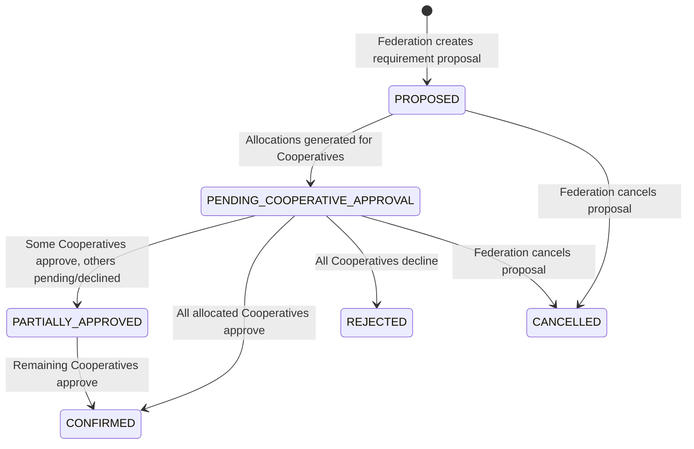

# CSHRK Phase 3 — Cooperative & Federation Handover Document

```text
================================================================================
  PROJECT:                 CSHRK (Cooperative Labour & Service Marketplace)
  CURRENT PHASE:           PHASE 3 COMPLETED & VERIFIED
  PREVIOUS PHASES:         PHASE 0 (Foundation), PHASE 1 (Worker), PHASE 2 (Customer)
  NEXT PHASE:              PHASE 4 — PAYMENTS & AI INTELLIGENCE
  DEVELOPMENT BRANCH:      feature/phase-3-cooperative-federation
  STATUS:                  COOPERATIVE & FEDERATION OPERATING LAYER VERIFIED
================================================================================
```

---

## 1. Phase 3 Executive Summary & Objectives

**Phase 3 — Cooperative & Federation Operations** establishes the organizational operating layer for CSHRK, empowering Primary Labour Cooperative Societies to actively operate their enrolled workforce, manage capacity, and execute multi-worker contracts, while enabling Labour Cooperative Federations to function as regional network orchestrators and capacity aggregators.

### Core Objectives Achieved:
1. **Explicit Membership Architecture**: `UserEntity` remains completely unmodified. Organizational linkages, worker affiliation histories, and status transitions (`PENDING` → `ACTIVE` → `SUSPENDED` → `INACTIVE`) are modeled through explicit relational entities (`CooperativeMembershipEntity` and `FederationMembershipEntity`).
2. **Server-Side Multi-Tenant Scope Isolation**: Strict server-side RBAC guaranteeing that a `COOPERATIVE_ADMIN` cannot access or mutate another cooperative society's private workforce, crews, or operational capacity (`HTTP 403 Forbidden`).
3. **Time-Window Aware Workforce Capacity**: Capacity calculations are time-window aware, distinguishing `totalWorkforce`, `activeWorkforce`, `availableWorkers`, `committedWorkforce` (workers with overlapping active bookings or jobs in the window), `unavailableWorkers`, and `availableCapacity`.
4. **Worker Crews & Team Management**: Support for multi-worker crews (`WorkerTeamEntity` and `TeamMemberEntity`) with crew leaders, trade skill composition, and project assignment.
5. **Organizational Work engagements (Zero Financial Pricing)**: Formal contracts, structured multi-trade projects, large jobs (e.g. "Need 6 electricians for 10 days"), and workforce requirements with deterministic fulfillment evaluation. All pricing and tariff fields (`dailyRate`) are strictly excluded and deferred to Phase 4.
6. **Multi-Cooperative Fulfillment Workflow**: Federation-level capacity pooling using a proposal/approval state machine (`PROPOSED` → `PENDING_COOPERATIVE_APPROVAL` → `PARTIALLY_APPROVED` → `CONFIRMED` / `REJECTED`). Capacity is never committed silently without explicit cooperative approval.
7. **Append-Only Governance & Audit Trail**: Immutable, append-only `AuditLogEntity` capturing actor (`userId`), action, entity type, entity ID, metadata, and timestamps with zero mutation/deletion capabilities.
8. **Admin Web Operations Suite**: Comprehensive operations UI in `apps/admin-web` for Cooperative Capacity, Teams, Large Jobs, Projects, Contracts, Federation Dashboard, and Audit Logs.
9. **Zero Regressions**: Phase 0 Foundation, Phase 1 Worker, and Phase 2 Customer Marketplace remain 100% operational.

---

## 2. Domain & Entity Architecture

```
                                  ┌───────────────────────────────┐
                                  │       Federation Network      │
                                  │ (Aggregated Capacity, Proposals)
                                  └───────────────┬───────────────┘
                                                  │
                  ┌───────────────────────────────┴───────────────────────────────┐
                  ▼                                                               ▼
    ┌───────────────────────────────┐                               ┌───────────────────────────────┐
    │     Cooperative Society A     │                               │     Cooperative Society B     │
    └───────┬───────────────┬───────┘                               └───────┬───────────────────────┘
            │               │                                               │
            ▼               ▼                                               ▼
┌───────────────────────┐ ┌───────────────────────┐           ┌───────────────────────┐
│ CooperativeMembership │ │   Worker Teams/Crews  │           │ CooperativeMembership │
│  (Worker & Admin)     │ │   & Project Linkages  │           │  (Worker & Admin)     │
└───────────────────────┘ └───────────────────────┘           └───────────────────────┘
            │
            ▼
┌───────────────────────────────────────────┐
│  Contracts, Projects, Large Jobs, Reqs    │
│  (Operational scope, zero financial rates)│
└───────────────────────────────────────────┘
```

### Exact Entity Relationships:
- **`CooperativeMembershipEntity` (`cooperative_memberships`)**: Links `userId` and `cooperativeId`, optional `workerId`, `memberId`, `role` (`MEMBER_WORKER` | `COOPERATIVE_ADMIN`), `status` (`MembershipStatus`), `joinedAt`, `leftAt`, `verifiedBy`, `verifiedAt`, `notes`.
- **`FederationMembershipEntity` (`federation_memberships`)**: Links `userId` and `federationId`, `role` (`FEDERATION_ADMIN`), `status`, `joinedAt`, `leftAt`.
- **`WorkerTeamEntity` (`worker_teams`)**: Links to `cooperativeId`, `name`, `description`, `leaderWorkerId`, `status` (`ACTIVE` | `ASSIGNED` | `DISBANDED`), `projectId`.
- **`TeamMemberEntity` (`team_members`)**: Links `teamId` and `workerId` with `role` (`LEADER` | `MEMBER`), `joinedAt`.
- **`ContractEntity` (`contracts`)**: Formal organizational contracts (`contractNumber`, `clientName`, `clientContact`, `cooperativeId`, `federationId`, `scope`, `startDate`, `endDate`, `status`).
- **`ProjectEntity` (`projects`)**: Multi-trade engagements (`title`, `cooperativeId`, `contractId`, `location`, `address`, `startDate`, `endDate`, `status`).
- **`LargeJobEntity` (`large_jobs`)**: Multi-worker jobs (`cooperativeId`, `projectId`, `title`, `organizationName`, `skillId`, `requiredWorkers`, `assignedWorkers`, `startDate`, `endDate`, `status`). Strictly NO `dailyRate`.
- **`WorkforceRequirementEntity` (`workforce_requirements`)**: Demand requirement (`contractId`, `projectId`, `skillId`, `quantity`, `fulfilledQuantity`, `locationCity`, `startDate`, `endDate`, `status`).
- **`FulfillmentPlanEntity` (`fulfillment_plans`)**: Multi-coop pooling proposals (`requirementId`, `federationId`, `title`, `status`).
- **`FulfillmentAllocationEntity` (`fulfillment_allocations`)**: Individual cooperative quota allocations (`planId`, `cooperativeId`, `allocatedWorkers`, `status`, `reviewedBy`, `reviewedAt`, `rejectionReason`).
- **`AuditLogEntity` (`audit_logs`)**: Append-only log (`userId`, `action`, `entityType`, `entityId`, `metadata`, `createdAt`).

---

## 3. Precise Workforce Capacity Model

Capacity calculations are executed via `GET /api/v1/cooperatives/:id/capacity?startDate=...&endDate=...&skillId=...`:

$$\text{Total Workforce} = \text{All affiliated workers in cooperative}$$
$$\text{Active Workforce} = \text{Affiliated workers with status } \texttt{ACTIVE}$$
$$\text{Available Workers} = \text{Active workers with availability } \neq \texttt{OFFLINE}$$
$$\text{Committed Workforce} = \text{Active workers with overlapping active bookings/jobs in the window}$$
$$\text{Unavailable Workers} = \text{Total Workforce} - \text{Available Workers}$$
$$\text{Available Capacity} = \max(0, \text{Available Workers} - \text{Committed Workforce})$$

---

## 4. Multi-Cooperative Fulfillment State Machine



---

## 5. API Endpoints Reference

### 5.1 Cooperative Module (`/api/v1/cooperatives`)
| Method | Path | Roles | Description |
| :--- | :--- | :--- | :--- |
| `GET` | `/cooperatives/me` | `COOPERATIVE_ADMIN` | Retrieve caller's authenticated cooperative society |
| `GET` | `/cooperatives/:id/capacity` | `COOPERATIVE_ADMIN`, `FEDERATION_ADMIN`, `PLATFORM_ADMIN` | Time-window aware operational workforce capacity |
| `GET` | `/cooperatives/:id/utilization` | `COOPERATIVE_ADMIN`, `FEDERATION_ADMIN`, `PLATFORM_ADMIN` | Workforce utilization rate & workload distribution |
| `GET` | `/cooperatives/:id/memberships` | `COOPERATIVE_ADMIN`, `FEDERATION_ADMIN`, `PLATFORM_ADMIN` | Query membership history & affiliation records |
| `PATCH` | `/cooperatives/:id/memberships/:membershipId/status` | `COOPERATIVE_ADMIN`, `FEDERATION_ADMIN`, `PLATFORM_ADMIN` | Transition worker verification / membership state |
| `GET` | `/cooperatives/:id/welfare-training` | `COOPERATIVE_ADMIN`, `FEDERATION_ADMIN`, `PLATFORM_ADMIN` | Welfare records and credential certification overview |

### 5.2 Federation Module (`/api/v1/federations`)
| Method | Path | Roles | Description |
| :--- | :--- | :--- | :--- |
| `GET` | `/federations/me` | `FEDERATION_ADMIN` | Retrieve caller's authenticated federation profile |
| `GET` | `/federations/:id/cooperatives` | `FEDERATION_ADMIN`, `PLATFORM_ADMIN` | Member cooperatives with enrolled worker counts |
| `GET` | `/federations/:id/workforce` | `FEDERATION_ADMIN`, `PLATFORM_ADMIN` | Query network workforce with trade skill & district filters |
| `GET` | `/federations/:id/capacity` | `FEDERATION_ADMIN`, `PLATFORM_ADMIN` | Network-aggregated capacity across member cooperatives |
| `GET` | `/federations/:id/geographic-coverage` | `FEDERATION_ADMIN`, `PLATFORM_ADMIN` | PostGIS spatial distribution of cooperatives and workers |
| `POST` | `/federations/:id/fulfillment-plans` | `FEDERATION_ADMIN`, `PLATFORM_ADMIN` | Create multi-coop pooling proposal (`PENDING_COOPERATIVE_APPROVAL`) |
| `GET` | `/federations/:id/fulfillment-plans` | Authorized Roles | List active pooling proposals and cooperative response states |
| `PATCH` | `/federations/fulfillment-allocations/:id/respond` | `COOPERATIVE_ADMIN`, `FEDERATION_ADMIN`, `PLATFORM_ADMIN` | Cooperative Admin approves or declines allocated quota |

### 5.3 Team Module (`/api/v1/teams`)
| Method | Path | Roles | Description |
| :--- | :--- | :--- | :--- |
| `POST` | `/teams` | `COOPERATIVE_ADMIN`, `PLATFORM_ADMIN` | Create worker crew/team under a cooperative |
| `GET` | `/teams` | Authorized Admins | List teams for a cooperative society |
| `GET` | `/teams/:id` | Authorized Admins | Team details, member roster, and skill composition |
| `PATCH` | `/teams/:id` | `COOPERATIVE_ADMIN`, `PLATFORM_ADMIN` | Update team metadata, leader, or status |
| `POST` | `/teams/:id/members` | `COOPERATIVE_ADMIN`, `PLATFORM_ADMIN` | Add affiliated worker to team (role `LEADER` or `MEMBER`) |
| `DELETE` | `/teams/:id/members/:workerId` | `COOPERATIVE_ADMIN`, `PLATFORM_ADMIN` | Remove worker from crew |

### 5.4 Organizational Operations (`/api/v1`)
| Method | Path | Roles | Description |
| :--- | :--- | :--- | :--- |
| `POST` | `/contracts` | Authorized Admins | Create formal workforce contract |
| `GET` | `/contracts` | Authorized Admins | List contracts filtered by cooperative or federation |
| `PATCH` | `/contracts/:id/status` | Authorized Admins | Transition contract status |
| `POST` | `/projects` | Authorized Admins | Create structured multi-trade project |
| `GET` | `/projects` | Authorized Admins | List projects with cooperative and contract linkage |
| `POST` | `/jobs` | Authorized Admins | Create large organizational job (strictly operational, no pricing) |
| `GET` | `/jobs` | Authorized Admins | List organizational jobs |
| `POST` | `/workforce-requirements` | Authorized Admins | Create multi-worker requirement |
| `GET` | `/workforce-requirements/:id` | Authorized Admins | Requirement with deterministic fulfillment evaluation (`FULL`/`PARTIAL`/`INSUFFICIENT`) |

### 5.5 Append-Only Audit Trail (`/api/v1/audit`)
| Method | Path | Roles | Description |
| :--- | :--- | :--- | :--- |
| `GET` | `/audit/logs` | Authorized Admins | Query append-only governance trail with filters and pagination |

---

## 6. Verification Results

### 6.1 Automated Unit Tests
```bash
npm run test --workspace=@cshrk/api
```
- **Result**: **15 passed, 15 total test suites**, **87 passed, 87 total unit tests**.
- Passing suites include `roles.guard.spec.ts`, `auth.service.spec.ts`, `health.controller.spec.ts`, `worker.service.spec.ts`, `skill.service.spec.ts`, `certification.service.spec.ts`, `cooperative.service.spec.ts`, `customer.service.spec.ts`, `service-catalog.service.spec.ts`, `service-request.service.spec.ts`, `booking.service.spec.ts`, `audit.service.spec.ts`, `team.service.spec.ts`, `federation.service.spec.ts`, `org-operations.service.spec.ts`.

### 6.2 TypeScript Type Check
```bash
npm run type-check
```
- **Result**: **0 errors across all 7 workspaces** (`@cshrk/config`, `@cshrk/types`, `@cshrk/validation`, `@cshrk/api`, `@cshrk/admin-web`, `@cshrk/customer-mobile`, `@cshrk/worker-mobile`).

### 6.3 Monorepo Production Build
```bash
npm run build
```
- **Result**: All packages, backend services, and web applications compile cleanly to production bundles.

### 6.4 Live End-to-End Test (Flows 1–5 & Tenant Isolation)
Run against live PostgreSQL 16 + PostGIS 3.4 container:
- **FLOW 1 (Cooperative Workforce & Capacity)**: Resolved caller's cooperative society via membership; retrieved member roster; calculated time-window operational capacity (Available vs Committed); verified utilization and welfare records.
- **FLOW 2 (Worker Affiliation & Verification)**: Retrieved membership history; transitioned verification status to `ACTIVE`; verified append-only audit trail entry in `/audit/logs`.
- **FLOW 3 (Large Job, Teams & Requirements)**: Created worker crew with leader; published large organizational job (verified strictly NO `dailyRate`); created workforce requirement; verified deterministic capacity calculation.
- **FLOW 4 (Federation Network View)**: Resolved caller's federation; listed member cooperatives with worker counts; aggregated network capacity; queried PostGIS spatial distribution.
- **FLOW 5 (Multi-Cooperative Fulfillment Workflow)**: Federation created fulfillment proposal; verified status `PENDING_COOPERATIVE_APPROVAL` (not committed silently); Cooperative 1 approved allocation; Cooperative 2 approved allocation; plan transitioned to `CONFIRMED`.
- **Tenant Scope Isolation**: Verified that Cooperative Admin 1 attempting to query Cooperative 2 receives `HTTP 403 Forbidden`.
- **Marketplace Compatibility**: Customer queried catalog, submitted request, matched worker via PostGIS geodesic query, and created booking in `PENDING_ACCEPTANCE`.

---

## 7. Scope Boundaries (Strict Preservation)

- **Payments & Settlements (Phase 4)**: Razorpay/Stripe, escrows, worker payouts, cooperative dividend calculations, customer checkout, and `dailyRate` financial fields remain strictly deferred to Phase 4.
- **AI & Labour Intelligence (Phase 4)**: Candidate discovery, capacity matching, and requirement evaluation are 100% deterministic. Machine learning matching, demand forecasting, and predictive allocation are deferred to Phase 4.
- **Dispute Arbitration & Legal Grievances (Phase 5)**: Full formal dispute arbitration workflows remain deferred to Phase 5.
- **Final UI Polishing (Phase Final)**: The Admin UI is fully functional and responsive; final visual polish belongs to Phase Final.

---

## 8. Instructions for Phase 4 Developer / AI Agent

1. **Inherited State**: Phase 3 is fully operational on branch `feature/phase-3-cooperative-federation`. You have access to real cooperative capacity, member rosters, worker crews, contracts, and multi-cooperative pooling proposals.
2. **Phase 4 Objective**: Implement **PAYMENTS & AI INTELLIGENCE**:
   - Integrate payment gateways, escrow mechanisms, and digital invoices (`PaymentEntity`, `InvoiceEntity`, `SettlementEntity`).
   - Implement worker payout calculations, cooperative commission splits, and transparent fee deduction.
   - Connect the Python FastAPI service (`services/ai`) for predictive demand forecasting, skill-gap analysis, and ML-assisted candidate re-ranking on top of the deterministic PostGIS queries.
3. **Important Invariant**: Do NOT bypass the explicit membership model or cooperative approval state machines established in Phase 3.
